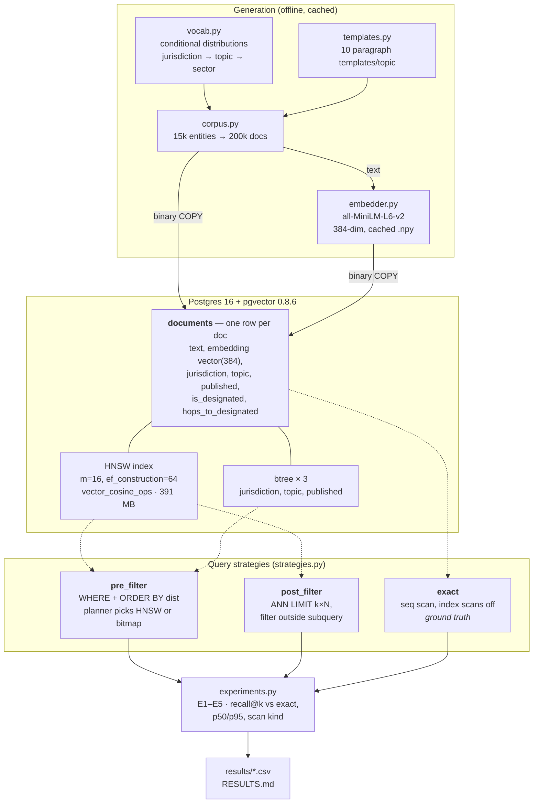

# vsbench — metadata filtering vs HNSW in pgvector

A small benchmark answering one question: **how does metadata filtering interact
with HNSW vector search in pgvector, and when does pre-filtering beat
post-filtering?**

Results and the written conclusion live in [RESULTS.md](RESULTS.md).

This is a learning exercise, not a product. There is no API, no UI, and no
reranking — just a corpus, three query strategies, and measurements.

## Architecture



The whole experiment is the dotted edges: **which index a filtered query actually
reaches.** `exact` never touches an index, `post_filter` always uses HNSW, and
`pre_filter` switches between HNSW and the btrees depending on selectivity —
that switch is the crossover E2 measures.

## Run it

```bash
docker compose up -d

uv venv --python 3.12 .venv
uv pip install --python .venv/bin/python \
    "psycopg[binary]>=3.2" "pgvector>=0.3.6" "numpy>=1.26" "sentence-transformers>=3.0"

.venv/bin/python scripts/run_all.py
```

First run generates 200k documents, embeds them with `all-MiniLM-L6-v2`
(~6 min on Apple Silicon MPS), COPYs them into Postgres, builds the HNSW index,
and runs E1–E5. The corpus and the embeddings are cached to `cache/`, so a
second run skips straight to the experiments.

```bash
.venv/bin/python scripts/run_all.py --n-docs 20000 --n-entities 2000   # quick smoke run
.venv/bin/python scripts/run_all.py --rebuild                          # force regenerate
.venv/bin/python scripts/make_report.py                                # rebuild RESULTS.md only
```

## Poke at it by hand

```bash
# unfiltered ANN — should show documents_embedding_hnsw
.venv/bin/python scripts/explain_query.py "tanker with an AIS gap before a ship to ship transfer"

# watch the plan flip as the filter tightens
.venv/bin/python scripts/explain_query.py "..." --filter "jurisdiction = 'AE'"
.venv/bin/python scripts/explain_query.py "..." --filter "jurisdiction = 'KZ' AND topic = 'forced_labour'"

# the other strategies
.venv/bin/python scripts/explain_query.py "..." --strategy post_filter --overfetch 50 --rows
.venv/bin/python scripts/explain_query.py "..." --strategy exact

# print SQL with the vector inlined, to paste into psql
.venv/bin/python scripts/explain_query.py "..." --emit-sql
```

Or straight from psql, using an existing row as the probe vector:

```sql
SET hnsw.ef_search = 40;
EXPLAIN (ANALYZE, BUFFERS)
SELECT doc_id, embedding <=> (SELECT embedding FROM documents WHERE doc_id = 42) AS distance
FROM documents
ORDER BY embedding <=> (SELECT embedding FROM documents WHERE doc_id = 42)
LIMIT 10;
```

## Layout

| path | what |
|---|---|
| `docker-compose.yml` | Postgres 16 + pgvector, tuned for an 8-core / 16 GB host |
| `schema.sql` | the `documents` table |
| `indexes.sql` | HNSW + three btrees, built after the bulk load |
| `vsbench/vocab.py` | name generation, alias noise, the conditional distributions |
| `vsbench/templates.py` | 10 paragraph templates per topic, 4–6 slots each |
| `vsbench/corpus.py` | 15k entities, 200k documents |
| `vsbench/embedder.py` | `Embedder` protocol, MiniLM implementation, disk cache |
| `vsbench/db.py` | connect, binary COPY, index build |
| `vsbench/filters.py` | builds the selectivity ladder by counting candidates |
| `vsbench/strategies.py` | `post_filter` / `pre_filter` / `exact`, plus EXPLAIN |
| `vsbench/experiments.py` | E1–E5 and the recall/latency metrics |
| `vsbench/findings.py` | the hand-written prose in RESULTS.md |
| `results/` | CSV per experiment, `meta.json`, `plans/*.txt` |

## The synthetic corpus

Two properties are deliberate, because without them the experiment is
degenerate:

**Structure in embedding space.** Documents cluster by topic × jurisdiction ×
sector, because vocabulary is drawn from topic-specific slot pools. A latent
`severity` score (derived from `hops_to_designated`) selects the register of the
closing sentences, giving a continuous gradient within each cluster. ~3% of
documents are deliberate near-copies — one slot changed — which is what
syndicated risk reporting actually looks like.

**Filter fields correlated with content.** `jurisdiction → topic → sector →
vocabulary` is a chain of conditional distributions, and publication year is
conditioned on topic. So a metadata filter is also a filter on a *region of
embedding space*. That is the case where post-filtering fails hardest: the ANN
walk heads for the global nearest neighbours and the filter deletes exactly
those. With independent filter fields, a 10× overfetch recovers most of the
recall and the experiment shows nothing.

Entity names carry realistic alias noise: transliteration variants (kh↔h, y↔i,
ts↔c), JSC/LLC/PJSC legal-form equivalents, suffix-stripped and
whitespace-removed forms, initialisms, and for ~15% a "formerly known as"
pointing at *another* entity's name pool. ~5% of entity names are one-token
near-collisions with another entity. Everything is fictitious.
# entity-risk-intelligence
